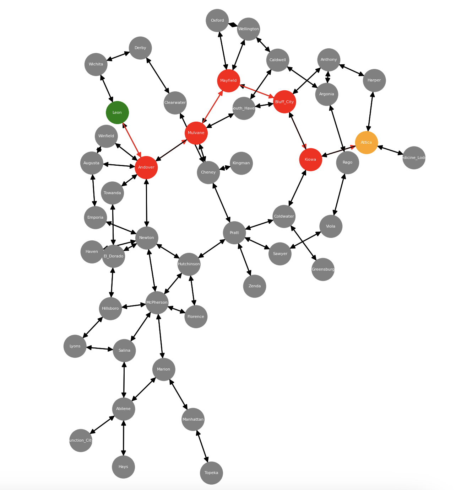
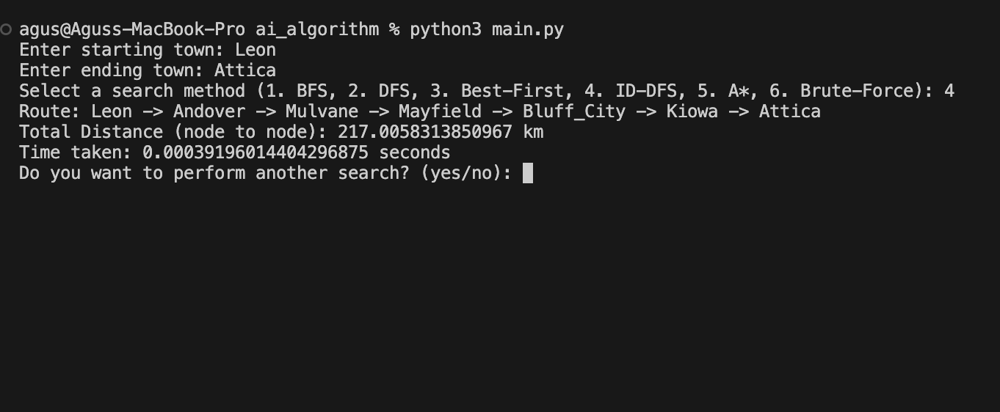

This program will take the form of an experimental report detailing findings of a comparison of each of the following methods:
1. undirected (blind) brute-force approach 
2. breadth-first search
3. depth-first search
4. ID-DFS search
5. best-first search
6. A* search

## Install Libraries
```
pip install -r requirements.txt
```

## Run the Program
```
python main.py
```

## Screenshots



